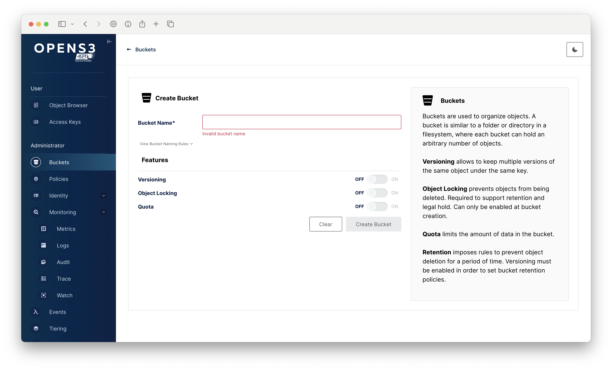

# Opens3 Console


Opens3 Console is a community-maintained fork of MinIO Console v1.7.3, preserving the full feature set that made the original console great. This fork exists to maintain and enhance the rich user interface capabilities that the community has come to rely on.

## Quick Start

### Option 1: Using Docker (Recommended)

You can use our official multi-architecture image (supports both amd64 and arm64):

```bash
# Pull and run the official image
docker run -p 9090:9090 \
  -e CONSOLE_MINIO_SERVER="https://your-minio-server" \
  -e CONSOLE_PBKDF_PASSPHRASE="your-secure-passphrase" \
  -e CONSOLE_PBKDF_SALT="your-secure-salt" \
  opens3/console:latest
```

### Option 2: Building from Source

Requirements:

- Node.js 20 or later with Yarn 4.4.0
- Go 1.24 or later
- Make

```bash
# Build everything
./build.sh

# Run the console (replace with your values)
export CONSOLE_MINIO_SERVER="https://your-minio-server"
export CONSOLE_PBKDF_PASSPHRASE="your-secure-passphrase"
export CONSOLE_PBKDF_SALT="your-secure-salt"
./console server
```

The console will be available at http://localhost:9090

## Features

- Complete bucket and object management
- Rich object browser with advanced upload capabilities
- Comprehensive user and policy management
- Monitoring and metrics dashboard
- Notification and event management
- Full server configuration interface

| Object Browser                     | Dashboard                     | Creating a bucket             |
| ---------------------------------- | ----------------------------- | ----------------------------- |
|  |  |  |

## Why This Fork?

Recent changes to the official MinIO Console have removed several important features that many users depend on. The Opens3 Console fork maintains these features and ensures they remain available to the community. Our goals are to:

- Preserve the complete feature set from MinIO Console v1.7.3
- Maintain compatibility with MinIO servers
- Continue community-driven development and improvements
- Keep the console fully open source under AGPL v3
- Ensure users have access to a feature-rich, self-hosted management UI
