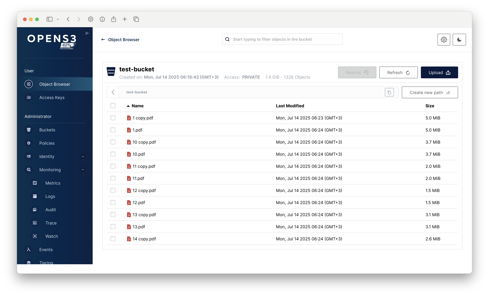

# Opens3 Console


Opens3 Console is a community-maintained fork of MinIO Console v1.7.3, preserving the full feature set that made the original console great. This fork exists to maintain and enhance the rich user interface capabilities that the community has come to rely on.

## Quick Start

### Option 1: Using Docker (Recommended)

You can either pull our official multi-architecture image:

```bash
# Pull and run the official image
docker run -p 9090:9090 \
  -e CONSOLE_MINIO_SERVER="https://your-minio-server" \
  -e CONSOLE_PBKDF_PASSPHRASE="your-secure-passphrase" \
  -e CONSOLE_PBKDF_SALT="your-secure-salt" \
  opens3/console:latest
```

Or build your own:

```bash
# Build the Docker image (replace 'username' with your Docker Hub username)
docker build -t username/console:latest .

# Generate secure random values for PBKDF
export CONSOLE_PBKDF_PASSPHRASE=$(openssl rand -base64 32)
export CONSOLE_PBKDF_SALT=$(openssl rand -base64 32)

# Save these values - you'll need them for future runs
echo "Generated PBKDF values (save these):"
echo "CONSOLE_PBKDF_PASSPHRASE=$CONSOLE_PBKDF_PASSPHRASE"
echo "CONSOLE_PBKDF_SALT=$CONSOLE_PBKDF_SALT"

# Run the console (using generated values)
docker run -p 9090:9090 \
  -e CONSOLE_MINIO_SERVER="https://your-minio-server" \
  -e CONSOLE_PBKDF_PASSPHRASE="$CONSOLE_PBKDF_PASSPHRASE" \
  -e CONSOLE_PBKDF_SALT="$CONSOLE_PBKDF_SALT" \
  username/console:latest
```

> Note: Replace `username` with your Docker Hub username if you plan to push the image, or use any other name for local use.
> Important: Save the generated PBKDF values - you'll need to use the same values each time you run the console to maintain consistent authentication.

The console will be available at http://localhost:9090

### Option 2: Building from Source

Requirements:

- Node.js 20 or later with Yarn 4.4.0
- Go 1.24 or later
- Make

```bash
# 1. Build the web application
cd web-app
yarn install
yarn build
cd ..

# 2. Build the console binary
make console

# 3. Run the console (replace with your values)
export CONSOLE_MINIO_SERVER="https://your-minio-server"
export CONSOLE_PBKDF_PASSPHRASE="your-secure-passphrase"
export CONSOLE_PBKDF_SALT="your-secure-salt"
./console server
```

## Features

- Complete bucket and object management
- Rich object browser with advanced upload capabilities
- Comprehensive user and policy management
- Monitoring and metrics dashboard
- Notification and event management
- Full server configuration interface

| Object Browser                     | Dashboard                     | Creating a bucket             |
| ---------------------------------- | ----------------------------- | ----------------------------- |
|  |  |  |

## Why This Fork?

Recent changes to the official MinIO Console have removed several important features that many users depend on. The Opens3 Console fork maintains these features and ensures they remain available to the community. Our goals are to:

- Preserve the complete feature set from MinIO Console v1.7.3
- Maintain compatibility with MinIO servers
- Continue community-driven development and improvements
- Keep the console fully open source under AGPL v3
- Ensure users have access to a feature-rich, self-hosted management UI

## MinIO Setup

To use the console, you need a MinIO user with admin privileges.

> Note: We don't recommend using MinIO's Operator Credentials

### 1. Create an admin user using `mc`

```bash
mc admin user add myminio/ console REPLACE_WITH_SECRET_KEY
```

### 2. Create and apply admin policy

```bash
cat > admin.json << EOF
{
    "Version": "2012-10-17",
    "Statement": [{
            "Action": ["admin:*"],
            "Effect": "Allow",
            "Sid": ""
        },
        {
            "Action": ["s3:*"],
            "Effect": "Allow",
            "Resource": ["arn:aws:s3:::*"],
            "Sid": ""
        }
    ]
}
EOF

mc admin policy create myminio/ consoleAdmin admin.json
mc admin policy attach myminio consoleAdmin --user=console
```

## Advanced Configuration

### Environment Variables

- `CONSOLE_MINIO_SERVER`: Your MinIO server URL (required)
- `CONSOLE_PBKDF_PASSPHRASE`: Passphrase for JWT encryption (optional)
- `CONSOLE_PBKDF_SALT`: Salt for JWT encryption (optional)
- `CONSOLE_DEBUG_LOGLEVEL`: Debug logging level (0-6, default: 0)

### TLS Support

To enable TLS, place your certificates in `~/.console/certs`:

- `public.crt` - TLS certificate
- `private.key` - Private key
- `CAs/ca.crt` - CA certificate (for connecting to MinIO over TLS)

The console will automatically detect and use these certificates.

## Contributing

Please follow our [Contributor's Guide](https://github.com/opens3/console/blob/master/CONTRIBUTING.md)
